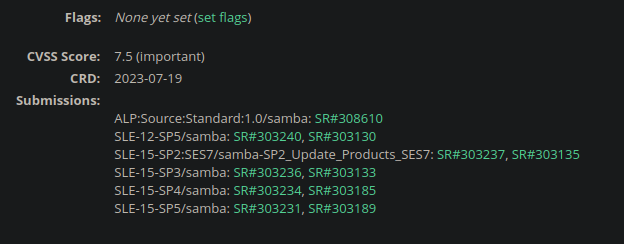
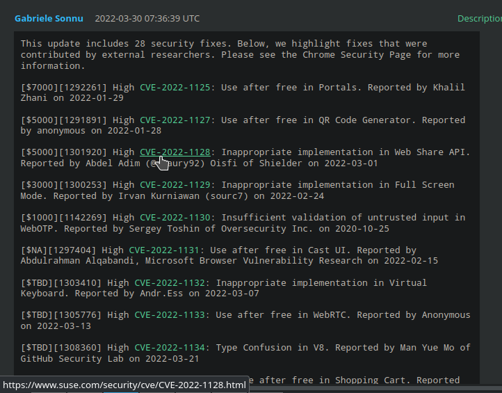
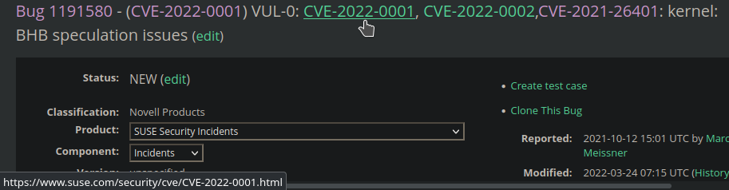
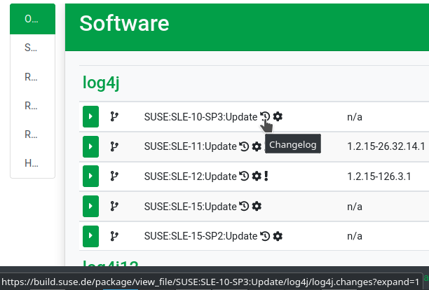
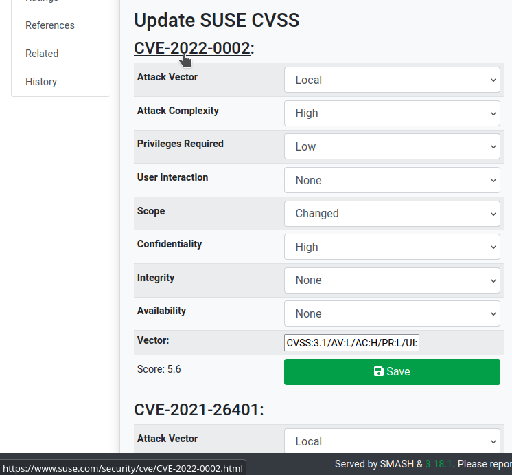
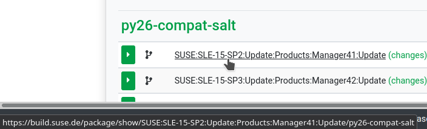
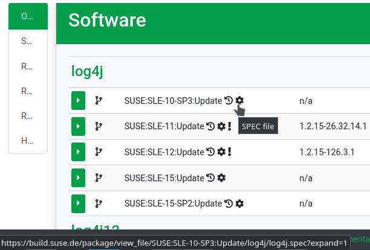

# Table of Contents

- [Userscripts](#userscripts)
  - [Bugzilla](#bugzilla)
    - [bugzilla-add-security-info.user.js](#bugzilla-add-security-infouserjs)
    - [bugzilla-add-suse-cve-links.user.js](#bugzilla-add-suse-cve-linksuserjs)
    - [bugzilla-bug-status-in-title.user.js](#bugzilla-bug-status-in-titleuserjs)
    - [bugzilla-fix-background.user.js](#bugzilla-fix-backgrounduserjs)
    - [bugzilla-hide-bots-comments.user.js](#bugzilla-hide-bots-commentsuserjs)
    - [bugzilla-meta-suse-beautifier.user.js](#bugzilla-meta-suse-beautifieruserjs)
    - [bugzilla-redirect-to-com.user.js](#bugzilla-redirect-to-comuserjs)
  - [IBS](#ibs)
    - [ibs-better-title.user.js](#ibs-better-titleuserjs)
  - [SMASH](#smash)
    - [smash-add-bugzilla-summary.user.js](#smash-add-bugzilla-summaryuserjs)
    - [smash-opensuse-actions.user.js](#smash-opensuse-actionsuserjs)
    - [smash-useful-links.user.js](#smash-useful-linksuserjs)
  - [SMELT](#smelt)
    - [smelt-better-ibs-integration.user.js](#smelt-better-ibs-integrationuserjs)
- [Installation](#installation)
- [Hooks](#hooks)

# Userscripts

## Bugzilla

### [bugzilla-add-security-info.user.js](Bugzilla/bugzilla-add-security-info.user.js)

Current version: 1.0.2

Adds security-relevant information to Bugzilla bugs: latest CRD specified, SUSE CVSS scores, submissions.

#### Screenshots

### [bugzilla-add-suse-cve-links.user.js](Bugzilla/bugzilla-add-suse-cve-links.user.js)

Current version: 1.0.7

Add links to SUSE CVE pages in title and comments.

#### Screenshots

### [bugzilla-bug-status-in-title.user.js](Bugzilla/bugzilla-bug-status-in-title.user.js)

Current version: 1.0.0

Puts the bug status (only if closed) in the page title.

### [bugzilla-fix-background.user.js](Bugzilla/bugzilla-fix-background.user.js)

Current version: 1.2.0

Fixes the bugzilla background for better integration with the Dark Reader addon.

### [bugzilla-hide-bots-comments.user.js](Bugzilla/bugzilla-hide-bots-comments.user.js)

Current version: 1.3.1

Hides bots comment in bugzilla by default. Also add links to quickly collapse or expand them as needed.

#### Screenshots

### [bugzilla-meta-suse-beautifier.user.js](Bugzilla/bugzilla-meta-suse-beautifier.user.js)

Current version: 1.0.0

Meta userscript containing all Bugzilla graphical addition and fixes.

### [bugzilla-redirect-to-com.user.js](Bugzilla/bugzilla-redirect-to-com.user.js)

Current version: 1.1.1

Redirects all bugzilla.opensuse.org bug pages to bugzilla.suse.com. The redirecting is done when opening a link to a bug on bugzilla.opensuse.org.

## IBS

### [ibs-better-title.user.js](IBS/ibs-better-title.user.js)

Current version: 1.0.1

Changes the title in IBS project/package/file view.

## SMASH

### [smash-add-bugzilla-summary.user.js](SMASH/smash-add-bugzilla-summary.user.js)

Current version: 1.0.0

Add summary for Bugzilla bugs in the Overview tab.

#### Screenshots

### [smash-opensuse-actions.user.js](SMASH/smash-opensuse-actions.user.js)

Current version: 1.2.4

Adds a button to open a bug in the openSUSE bugzilla tracker. Also updates the action item in the Actions dropdown with the same link.

#### Screenshots

### [smash-useful-links.user.js](SMASH/smash-useful-links.user.js)

Current version: 1.5.0

Adds links to the package, package support status page, package changes and spec file & SUSE CVE page in the SMASH issue page.

#### Screenshots

## SMELT

### [smelt-better-ibs-integration.user.js](SMELT/smelt-better-ibs-integration.user.js)

Current version: 1.1.0

Add links to IBS project (patchinfo and package repository) to the SMELT incident page.

#### Screenshots

# Installation

These userscripts should be used with browsers addons such as Violentmonkey, Firemonkey, Greasemonkey or Tampermonkey.
To install the script you can use the raw link for every script or serve them from an HTTP server. When you open a link to an user.js file the addon should prompt you to install the script.

# Hooks

The [.hooks](.hooks) directory contains useful hooks to ease management of this repository.  
In particular, the [pre-commit](.hooks/pre-commit) hooks contains a script to automatically generate the README.md file with every commit.  
The directory containing the userscript will be used to determine its section (i.e. all the userscripts in the `Bugzilla` directory will be shown under the Bugzilla section). The userscripts will be listed in alphabetic order.  
The description will be extracted from the `@description` meta data in the script file, and the content of any markdown file with the name of the script inside the [docs/script](docs/scripts) directory will be appended (i.e. for a script called `my-script.user.js` all the `docs/scripts/my-script*.md` files will be processed).
The markdown files will be appended in alphabetic order.  
The same is valid for images inside the [images](images) directory, all the images which filename starts with the script name will be added - in alphabetic order - to the script description.
